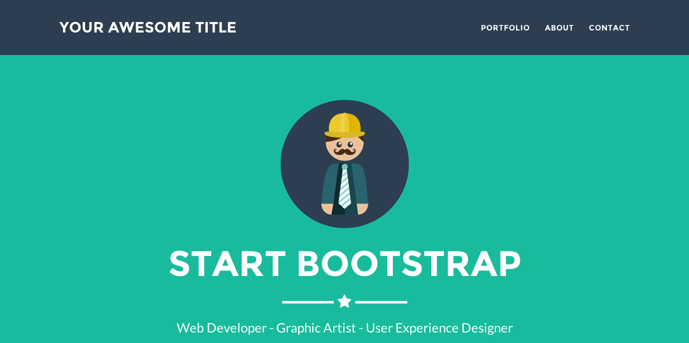

# Lucid Jekyll theme  [](https://travis-ci.org/kelley12/lucid-jekyll-theme/) 

Jekyll theme based on [Freelancer bootstrap theme](http://startbootstrap.com/template-overviews/freelancer/)

## Screenshot



## Installation

Add this line to your Jekyll site's `Gemfile`:

```ruby
gem "lucid-jekyll-theme"
```

And add this line to your Jekyll site's `_config.yml`:

```yaml
theme: lucid-jekyll-theme
```

And then execute:

```bash
bundle
```

Or install it yourself as:

```bash
gem install lucid-jekyll-theme
```

## How to use

- Place a image in `/assets/img/portfolio/`
- Replace `your-email@domain.com` in `_config.yml` with your email address. Refer to [formspree](http://formspree.io/) for more information.
- Create posts to display your projects. Use the follow as an example:

```txt
---
layout: default
modal-id: 1
date: 2014-07-18
img: cabin.png
alt: image-alt
project-date: July 2014
client: The Client
category: Web Development
description: The description of the project
---
```

## Usage

### Layouts

#### Default

The default theme is what is used for the main page

### Includes

The includes directory contains 3 folders: head, body, and sections

#### Head

The head directory contains all html files used in the `<head>` tag of the website.

#### Body

The body directory contains all html files used in the `<body>` tag of the website.

#### Sections

The sections directory contains all of the html files used to populate the home page. These files are added and ordered in `_config.yml`.

For example:

```yml
sections:
  - title: Portfolio
    filename: portfolio_grid.html
  - title: About
    filename: about.html
    css-class: success
```

The `Portfolio` section will be first using the `portfolio_grid.html` file in `_includes/sections/` followed by `About`.

### Assets

Used to store images for the background images and the portfolio section if used

## Demo

View this jekyll theme in action [here](https://kelley12.github.io/lucid-jekyll-theme)

## Contributing

Bug reports and pull requests are welcome on GitHub at https://github.com/Kelley12/liminal-jekyll-theme. This project is intended to be a safe, welcoming space for collaboration, and contributors are expected to adhere to the [Contributor Covenant](http://contributor-covenant.org) code of conduct.
